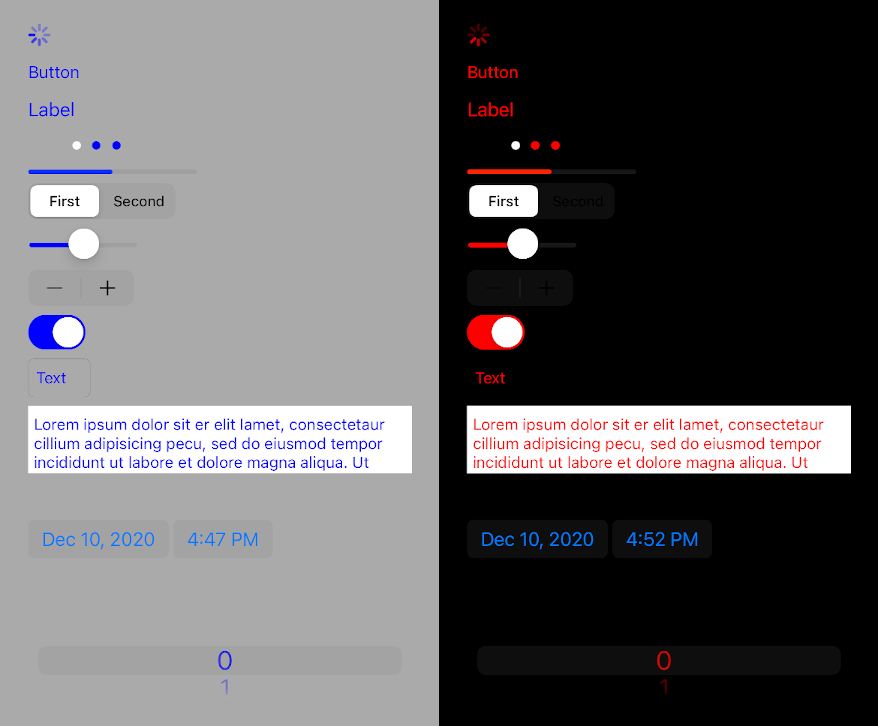
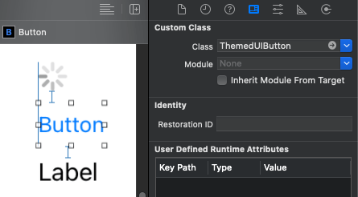

# DXS.ThemedUI
Xamarin iOS Theme System



## Installation
DXS.ThemedUI is available via NuGet: [](https://www.nuget.org/packages/DXS.ThemedUI)

## How to use DXS.ThemedUI

Add on Main.cs Main method:

```csharp
...
ThemedUI.Init(new YourTheme());
UIApplication.Main(args, null, "AppDelegate");
...
```

YourTheme.cs should look something like this:

```csharp
public class YourTheme : ITheme
{
    UIColor _primaryColor = UIColor.Red;
    UIColor _backgroundColor = UIColor.Black;

    public IStyle<ThemedUIView> ThemedUIViewStyle => new Style<ThemedUIView>(view =>
    {
        view.BackgroundColor = _backgroundColor;
    });

    public IStyle<ThemedUIButton> ThemedUIButtonStyle => new Style<ThemedUIButton>(button =>
    {
        button.TintColor = _primaryColor;
    });

    public IStyle<ThemedUILabel> ThemedUILabelStyle => new Style<ThemedUILabel>(label =>
    {
        label.TextColor = _primaryColor;
    });
}
```

Now if you are using Storyboards, use the ThemedUI custom classes:



If you, on the other hand, use code to generate your layout, just create your UIViews with the ThemedUI custom class:

```csharp
ThemedUILabel label = new ThemedUILabel();
````

## Add new style to Theme

If you want all your UILabels with the same style, change ThemedUILabelStyle and you are good to go. But must of the time we need more styles for the same element.

On YourTheme.cs, add:

```csharp
public IStyle<ThemedUILabel> BlueLabelStyle => new Style<ThemedUILabel>(view =>
{
    view.TextColor = UIColor.Blue;
});
```

And create your blue label object:

```csharp
YourTheme CurrentTheme = ThemedUI.GetCurrentTheme<YourTheme>();
...
ThemedUILabel label = new ThemedUILabel().WithStyle(CurrentTheme.BlueLabelStyle);
````

You can use inheritance, and create a centered blue label, like:

```csharp
public IStyle<ThemedUILabel> CenterBlueLabelStyle => new Style<ThemedUILabel>(BlueLabelStyle, view =>
{
    view.TextAlignment = UITextAlignment.Center;
});
```

## Available ThemedUI classes
* ThemedUIActivityIndicatorView
* ThemedUIButton
* ThemedUIDatePicker
* ThemedUILabel
* ThemedUIPageControl
* ThemedUIPickerView
* ThemedUIProgressView
* ThemedUISegmentedControl
* ThemedUISlider
* ThemedUIStepper
* ThemedUISwitch
* ThemedUITextField
* ThemedUITextView
* ThemedUIView

## Build nuget
If you want to build your own DXS.ThemedUI nuget package, first build the project in Release, then run the command:

```
nuget pack DXS.ThemedUI.nuspec
```
